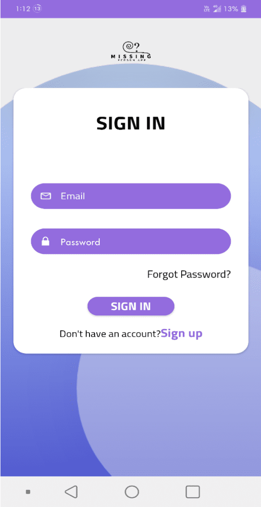
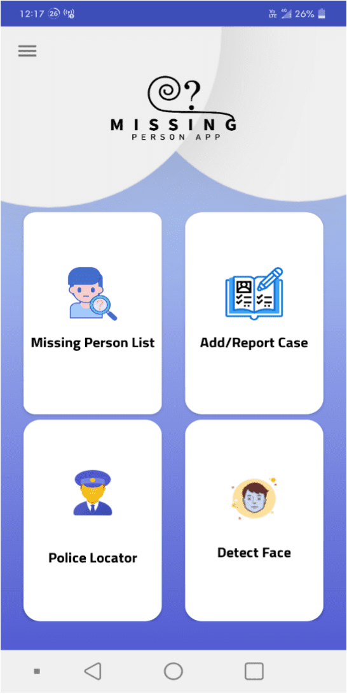
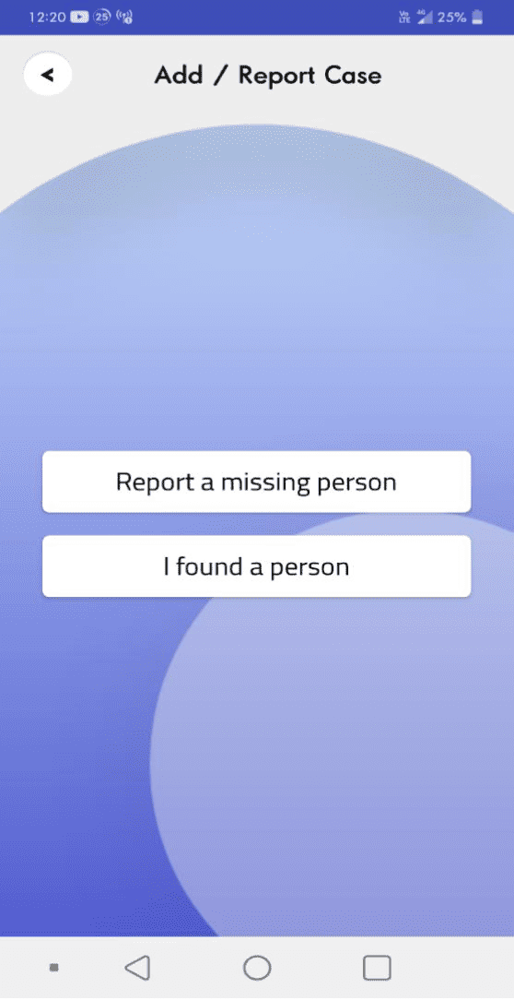
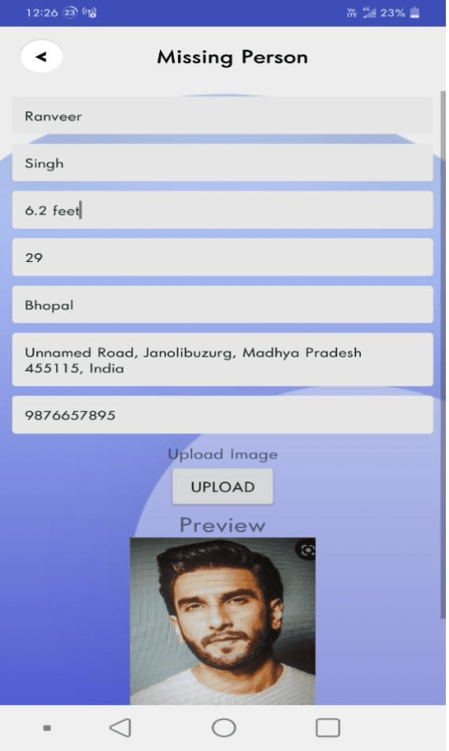
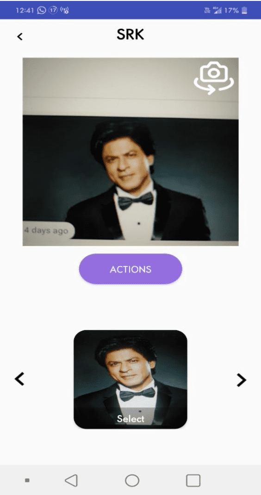
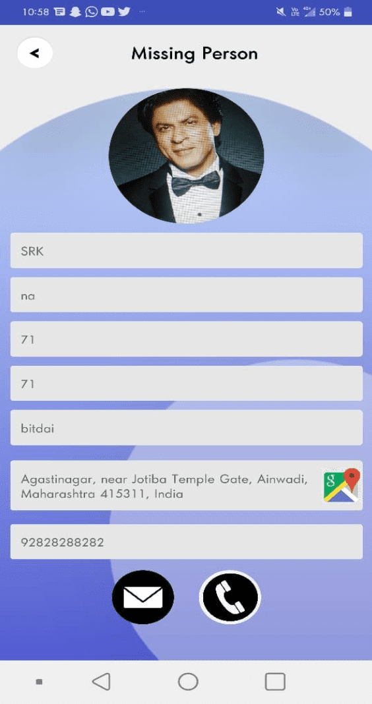
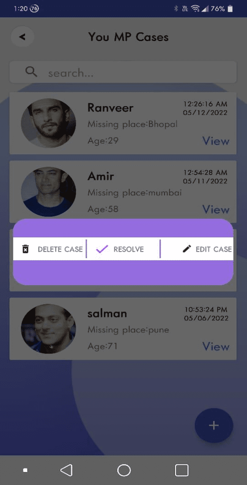

# Laapata-Find-Missing-Person-Using-AI
Find Missing Person Using AI: It is an android application to locate the missing person using image recognition. Anybody can just upload the missing person/Child's image, then that image is matched to the already uploaded voluntary database using AI. If a match is found, the parent and authority will be informed.

#### Some Screenshots of this app

 Login                               | SignUp                                        | Reset Password 			                    | Dashboard
:------------------------------------------:|:-------------------------------------------:|:-----------------------------------------------:|:----------------------------------------:
  |   ||

 Missing Person List                         | Add/Report Case                             | Upload Case with details                      | Police Station Locator
:-----------------------------------------:|:--------------------------------------------:|:-----------------------------------------------:|:-------------------------------------:
 | ||
 
 Face Detection                           | Detected Profile                             | Delete, Resolve, Edit Case                      | Chat with Reporter
:-----------------------------------------:|:--------------------------------------------:|:-----------------------------------------------:|:-------------------------------------:
 | ||
 
 
## License

[MIT](https://choosealicense.com/licenses/mit/)

## Support

For support, email pawarsanskar50@gmail.com 
 
 
 
 
 
 
 
 
 
 
 
 
 
 
 
 
